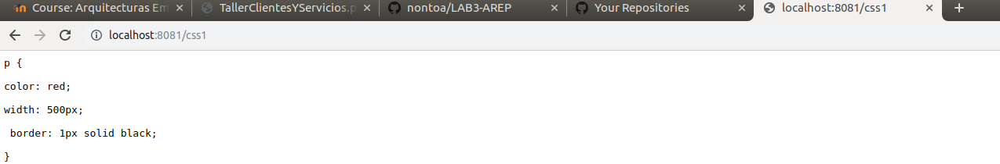

# Laboratorio 3 AREP


## Empezando

Para clonar el archivo:

>git clone https://github.com/nontoa/LAB3/AREP.git
>
### Prerrequisitos
* Maven
* Java
* Git

## Trabajando con URLs

### URL
URL es la abreviación de Uniform Resource Locator, y es básicamente una dirección para localizar recursos en internet. Una idea clara de
como son las URLs la encontramos en nuestro navegador de internet. Así, la forma general de una URL es la siguiente:

    <protocolo>://<servidor>:<puerto>/<dirección del recurso en el servidor>
    
### Métodos para leer información de un objeto URL
	System.out.println(google.getAuthority());//USE->Este metodo se usa
   	System.out.println(google.getPath());//USE->Este metodo muestra el path de la url de donde lo quiere buscar
   	System.out.println(google.getProtocol());//USE->Este metodo muetra el protocolo que se usa para la transferencia de datos puede ser http,https.....
   	System.out.println(google.getHost());//USE->Este metodo muestra el Host de la url
   	System.out.println(google.getQuery());//USE->Este metodo se usa cuando se manda algun formulario y apartir de este se hace una consulta
   	System.out.println(google.getFile());//USE->Este metodo se usa para ver toda la consulta sobre un archivo apartir de este me muetra la carpeta y el query que yo le realize
   	System.out.println(google.getRef());//USE->Este metodo muestra donde esta la referencia al objeto va despues de un #


## Ejercicio 1

Escriba un programa en el cual usted cree un objeto URL e imprima en pantalla cada uno de los datos que retornan los 8 métodos de la sección anterior.

### Codificación

```java
import java.io.*;
import java.net.*;

public class URLReader {

	public static void main(String[] args) throws Exception {
    
		URL facebook = new URL("http://www.facebook.com/");
		try (BufferedReader reader = new BufferedReader(new InputStreamReader(facebook.openStream()))) {
			String inputLine = null;
			while ((inputLine = reader.readLine()) != null) {
				System.out.println(inputLine);
			}			
			System.out.println(facebook.getAuthority()+"\n");
			System.out.println(facebook.getProtocol()+"\n");
			System.out.println(facebook.getPath()+"\n");
			System.out.println(facebook.getHost()+"\n");
			System.out.println(facebook.getPort()+"\n");
			System.out.println(facebook.getQuery()+"\n");
			System.out.println(facebook.getFile()+"\n");
			System.out.println(facebook.getRef()+"\n");
		} catch (IOException x) {
			System.err.println(x);
		}
	}
}
```

## Ejercicio 2

Escriba una aplicación browser que pregunte una dirección URL al usuario y que lea datos de esa dirección y que los almacene en un archivo con el nombre resultado.html. Luego intente ver este archivo en el navegador.

### Codificación

```java
import java.io.BufferedReader;
import java.io.BufferedWriter;
import java.io.File;
import java.io.FileWriter;
import java.io.IOException;
import java.io.InputStreamReader;
import java.net.URL;

public class LectorURL {
    public static void main(String[] args) throws Exception {
		BufferedReader in = new BufferedReader(new InputStreamReader(System.in));
                String datos="";
		String userURL= in.readLine();
		
	    	URL page = new URL("https://www."+userURL);
	    
	    	try (BufferedReader reader = new BufferedReader(new InputStreamReader(page.openStream()))) {
			String inputLine = null;
			while ((inputLine = reader.readLine()) != null) {
				datos+=inputLine;
			}
		} catch (IOException x) {
			System.err.println(x);
		}
		
    		BufferedWriter bw = null;
	    	FileWriter fw = null;

	    try {
		File file = new File("resultado.html");
		// Si el archivo no existe, se crea!
		if (!file.exists()) {
		    file.createNewFile();
		}
		// flag true, indica adjuntar informacion al archivo.
		fw = new FileWriter(file.getAbsoluteFile(), true);
		bw = new BufferedWriter(fw);
		bw.write(datos);
	    } catch (IOException e) {
		e.printStackTrace();
	    } finally {
	        try {
                //Cierra instancias de FileWriter y BufferedWriter.
	            if (bw != null)
	                bw.close();
	            if (fw != null)
	                fw.close();
	        } catch (IOException ex) {
	            ex.printStackTrace();
	        }
	    }
	}
}
```

## Sockets

Los sockets son los puntos finales del enlace de comunicación entre dos programas ejecutándose en la red. Cada socket esta vinculado a un puerto específico.

Para que dos programas puedan comunicarse entre sí es necesario que se cumplan ciertos requisitos:

* Que un programa sea capaz de localizar al otro.

* Que ambos programas sean capaces de intercambiarse cualquier secuencia de octetos, es decir, datos relevantes a su finalidad.

Para ello son necesarios los dos recursos que originan el concepto de socket:

* Un par de direcciones del protocolo de red (dirección IP, si se utiliza el protocolo TCP/IP), que identifican la computadora de origen y la remota.

* Un par de números de puerto, que identifican a un programa dentro de cada computadora.

Los sockets permiten implementar una arquitectura cliente-servidor. La comunicación debe ser iniciada por uno de los programas que se denomina programa "cliente". El segundo programa espera a que otro inicie la comunicación, por este motivo se denomina programa "servidor".

## Ejercicio 4.3.1

Escriba un servidor que reciba un número y responda el cuadrado de este número.

### Codificacion Cliente

```java
import java.io.*;
import java.net.*;

public class SocketCliente {
	public static void main(String[] args) throws IOException {
	
		Socket echoSocket = null;
		PrintWriter out = null;
		BufferedReader in = null;
		try {
			echoSocket = new Socket("127.0.0.1", 8182);
			out = new PrintWriter(echoSocket.getOutputStream(), true);
			in = new BufferedReader(new InputStreamReader(echoSocket.getInputStream()));
		} catch (UnknownHostException e) {
			System.err.println("Don’t know about host!.");
			System.exit(1);
		} catch (IOException e) {
			System.err.println("Couldn’t get I/O for " + "the connection to: localhost.");
			System.exit(1);
		}
		BufferedReader stdIn = new BufferedReader(new InputStreamReader(System.in));
		String userInput;
		while ((userInput = stdIn.readLine()) != null) {
			out.println(userInput);
			System.out.println("echo: " + in.readLine());
		}
		out.close();
		in.close();
		stdIn.close();
		echoSocket.close();
	}
}
```
### Codificacion Servidor

```java
import java.net.*;
import java.io.*;

public class SocketServidor {

	public static void main(String[] args) throws IOException {
	
		ServerSocket serverSocket = null;
		try {
			serverSocket = new ServerSocket(8081);
		} catch (IOException e) {
			System.err.println("Could not listen on port: 35000.");
			System.exit(1);
		}
		Socket clientSocket = null;
		try {
			clientSocket = serverSocket.accept();
		} catch (IOException e) {
			System.err.println("Accept failed.");
			System.exit(1);
		}
		PrintWriter out = new PrintWriter(clientSocket.getOutputStream(), true);
		BufferedReader in = new BufferedReader(new InputStreamReader(clientSocket.getInputStream()));
		String inputLine, outputLine;
		while ((inputLine = in.readLine()) != null) {
			System.out.println("Mensaje: " + inputLine);
			int number=Integer.parseInt(inputLine);
			outputLine = "Respuesta " + (number*number);
			out.println(outputLine);
			if (outputLine.equals("Respuestas: Bye."))
				break;
		}
		out.close();
		in.close();
		clientSocket.close();
		serverSocket.close();
	}
}
```

## Ejercicio 4.3.2

Escriba un servidor que pueda recibir un número y responda con un operación sobre este número. Este servidor puede recibir un mensaje que empiece por “fun:”, si recibe este mensaje cambia la operación a las especificada. El servidor debe responder las funciones seno, coseno y tangente. Por defecto debe empezar calculando el coseno. Por ejemplo, si el primer número que recibe es 0, debe responder 1, si después recibe π/2 debe responder 0, si luego recibe “fun:sin” debe cambiar la operación actual a seno, es decir a a partir de ese momento debe calcular senos. Si enseguida recibe 0 debe responder 0.

### Codificacion Cliente

```java
import java.io.*;
import java.net.*;

public class SocketCliente {
	public static void main(String[] args) throws IOException {
	
		Socket echoSocket = null;
		PrintWriter out = null;
		BufferedReader in = null;
		try {
			echoSocket = new Socket("127.0.0.1", 8182);
			out = new PrintWriter(echoSocket.getOutputStream(), true);
			in = new BufferedReader(new InputStreamReader(echoSocket.getInputStream()));
		} catch (UnknownHostException e) {
			System.err.println("Don’t know about host!.");
			System.exit(1);
		} catch (IOException e) {
			System.err.println("Couldn’t get I/O for " + "the connection to: localhost.");
			System.exit(1);
		}
		BufferedReader stdIn = new BufferedReader(new InputStreamReader(System.in));
		String userInput;
		while ((userInput = stdIn.readLine()) != null) {
			out.println(userInput);
			System.out.println("echo: " + in.readLine());
		}
		out.close();
		in.close();
		stdIn.close();
		echoSocket.close();
	}
}
```

### Codificacion Servidor
```java
import java.net.*;
import java.util.StringTokenizer;
import java.io.*;

public class SocketOperacionesServidor {
	
	public static void main(String[] args) throws IOException {
		ServerSocket serverSocket = null;
		try {
			serverSocket = new ServerSocket(8182);
		} catch (IOException e) {
			System.err.println("Could not listen on port: 35000.");
			System.exit(1);
		}
		Socket clientSocket = null;
		try {
			clientSocket = serverSocket.accept();
		} catch (IOException e) {
			System.err.println("Accept failed.");
			System.exit(1);
		}
		PrintWriter out = new PrintWriter(clientSocket.getOutputStream(), true);
		BufferedReader in = new BufferedReader(new InputStreamReader(clientSocket.getInputStream()));
		String inputLine, outputLine, funcion;
		funcion="coseno";
		while ((inputLine = in.readLine()) != null) {
			StringTokenizer st = new StringTokenizer(inputLine);
			String temp=st.nextToken();
			double val =0.0;
			outputLine = "Respuesta ";
			if (isNumeric(temp)== true) {
				if(funcion.equals("coseno")) {
					Double fa = Double.parseDouble(temp);
					val = Math.cos(fa);
					outputLine+=val;
				}
				else if(funcion.equals("seno")) {
					Double fa = Double.parseDouble(temp);
					val = Math.sin(fa);
					outputLine+=val;
				}
				else {
					Double fa = Double.parseDouble(temp);
					val = Math.tan(fa);
					outputLine+=val;
				}
			}
			else {
				if(temp.equals("fun:sin")) {
					funcion="seno";
					outputLine+="funcion acutal seno";
				}
				else if(temp.equals("fun:cos") || temp.equals("fun:")) {
					funcion="coseno";
					outputLine+="funcion acutal coseno";
				}
				else if(temp.equals("fun:tan")) {
					funcion="tangente";
					outputLine+="funcion acutal tangente";
				}
			}
			out.println(outputLine);
			if (temp.equals("Bye"))
				break;
		}
		out.close();
		in.close();
		clientSocket.close();
		serverSocket.close();
	}
	
	
	public static boolean isNumeric(String cadena) {

        boolean resultado;

        try {
            Integer.parseInt(cadena);
            resultado = true;
        } catch (NumberFormatException excepcion) {
            resultado = false;
        }

        return resultado;
    }
}
```

## Ejercicio 4.4

El código 4 presenta un servidor web que atiende una solicitud. Implemente el servidor e intente conectarse desde el browser.

### Codificacion Cliente

```java
package edu.eci.arsw;

import java.io.*;
import java.net.*;

public class SocketCliente {

	public static void main(String[] args) throws IOException {
	
		Socket echoSocket = null;
		PrintWriter out = null;
		BufferedReader in = null;
		try {
			echoSocket = new Socket("127.0.0.1", 38000);
			out = new PrintWriter(echoSocket.getOutputStream(), true);
			in = new BufferedReader(new InputStreamReader(echoSocket.getInputStream()));

		} catch (UnknownHostException e) {
			System.err.println("Don’t know about host!.");
			System.exit(1);
		} catch (IOException e) {
			System.err.println("Couldn’t get I/O for " + "the connection to: localhost.");
			System.exit(1);
		}
		BufferedReader stdIn = new BufferedReader(new InputStreamReader(System.in));
		String userInput;
		System.out.println("Digita una url para ver el proceso");
		System.out.println("Por fa que no este codificada");
		while ((userInput = stdIn.readLine()) != null) {
			out.println(userInput);
			System.out.println("echo: " + in.readLine());
		}
		out.close();
		in.close();
		stdIn.close();
		echoSocket.close();
	}
}
```
### Codificacion Servidor

```java
package edu.eci.arsw;

import java.net.*;
import java.io.*;

public class HttpServerBasico {
	public static void main(String[] args) throws IOException {
		ServerSocket serverSocket = null;
		try {
			serverSocket = new ServerSocket(46000);
		} catch (IOException e) {
			System.err.println("Could not listen on port: 35000.");
			System.exit(1);
		}
		Socket clientSocket = null;
		PrintWriter out;
		BufferedReader in;
		for (;;) {
			try {
				System.out.println("Listo para recibir ...");
				clientSocket = serverSocket.accept();
			} catch (IOException e) {
				System.err.println("Accept failed.");
				System.exit(1);
			}
			out = new PrintWriter(clientSocket.getOutputStream(), true);
			in = new BufferedReader(new InputStreamReader(clientSocket.getInputStream()));
			String inputLine;
			while ((inputLine = in.readLine()) != null) {
				System.out.println("Received: " + inputLine);
				if (!in.ready()) {
					break;
				}
			}
			out.println("HTTP/1.1 200 OK");
			out.println("Content-Type: text/html" + "\r\n");
			out.println("<!DOCTYPE html>" + "\r\n");
			out.println("<html>" + "\r\n");
			out.println("<head>" + "\r\n");
			out.println("<meta charset=\"UTF-8\">" + "\r\n");
			out.println("<title>Title of the document</title>" + "\r\n");
			out.println("</head>" + "\r\n");
			out.println("<body>" + "\r\n");
			out.println("<h1>My Web Site</h1>" + "\r\n");
			out.println("</body>" + "\r\n");
			out.println("</html>" + "\r\n");
			out.flush();
		}
	}
}
```

## Ejercicio 4.5

Escriba un servidor web que soporte múltiples solicitudes seguidas (no concurrentes). El servidor debe retornar todos los archivos solicitados, incluyendo páginas html e imágenes.

### Codificacion Servidor

```java
package edu.eci.arsw;

import java.net.*;
import java.io.*;

public class HttpServer {

	private static ServerSocket serverSocket = null;

	private static boolean continuar = true;

	private static Socket clientSocket = null;

	public static void main(String[] args) throws IOException {

		try {
			serverSocket = new ServerSocket(38000);
			int counter = 0;
			while (continuar) {
				counter++;
				System.out.println("Listo para recibir ... " + counter);
				clientSocket = serverSocket.accept();
				String path = getPageRequest(clientSocket.getInputStream());
				if (path.equals("/html1"))
					html1(clientSocket.getOutputStream());
				else if (path.equals("/html2"))
					html2(clientSocket.getOutputStream());
				else if (path.equals("/image1"))
					image1(clientSocket.getOutputStream());
				else if (path.equals("/image2"))
					image2(clientSocket.getOutputStream());
				else if (path.equals("/image3"))
					image3(clientSocket.getOutputStream());
				else if (path.equals("/image4"))
					image4(clientSocket.getOutputStream());
				else if (path.equals("/css1"))
					css1(clientSocket.getOutputStream());
				clientSocket.close();
			}
		} catch (IOException e) {
			System.err.println("Could not listen on port: 35000.");
			System.exit(1);
		} finally {
			serverSocket.close();
		}
	}

	public static String getPageRequest(InputStream is) throws IOException {
		is.mark(0);
		BufferedReader in = new BufferedReader(new InputStreamReader(is));
		String inputLine = null;
		while ((inputLine = in.readLine()) != null) {
			if (!in.ready())
				break;
			if (inputLine.contains("GET")) {
				String[] get = inputLine.split(" ");
				return get[1];
			}
			break;
		}
		return "path";
	}

	// HTML
	public static void html1(OutputStream os) {
		PrintWriter response = new PrintWriter(os, true);
		response.println("HTTP/1.1 200 OK");
		response.println("Content-Type: text/html" + "\r\n");
		response.println("<!DOCTYPE html>" + "\r\n");
		response.println("<html>" + "\r\n");
		response.println("<head>" + "\r\n");
		response.println("<meta charset=\"UTF-8\">" + "\r\n");
		response.println("<title>Title of the document</title>" + "\r\n");
		response.println("</head>" + "\r\n");
		response.println("<body>" + "\r\n");
		response.println("<h1>My Web Site</h1>" + "\r\n");
		response.println("</body>" + "\r\n");
		response.println("</html>" + "\r\n");
		response.flush();
		response.close();
	}

	public static void html2(OutputStream os) {
		PrintWriter response = new PrintWriter(os, true);
		response.println("HTTP/1.1 200 OK");
		response.println("Content-Type: text/html" + "\r\n");
		response.println("<!DOCTYPE html>" + "\r\n");
		response.println("<html>" + "\r\n");
		response.println("<head>" + "\r\n");
		response.println("<meta charset=\"UTF-8\">" + "\r\n");
		response.println("<title>Cómo hacer una página web con HTML</title>" + "\r\n");
		response.println("</head>" + "\r\n");
		response.println("<body>" + "\r\n");
		response.println("<h1>Cómo hacer una página web con HTML</h1>" + "\r\n");
		response.println("<p> En el post de hoy voy a enseñarte <strong>cómo hacer una página web con HTML</strong>, pero antes …</p>" + "\r\n");
		response.println("<h2>Conceptos básicos sobre páginas web</h2>" + "\r\n");
		response.println("<p>¿Cuál es entonces la diferencia entre una página web y un sitio web?…</p>" + "\r\n");
		response.println("<h3>Diferencias entre una página web y un sitio web</h3>" + "\r\n");
		response.println("<p>Una <a href=”https://es.wikipedia.org/wiki/P%C3%A1gina_web”>página web</a> es un <strong>único documento electrónico</strong> que…</p>" + "\r\n");
		response.println("</body>" + "\r\n");
		response.println("</html>" + "\r\n");
		response.flush();
		response.close();
	}

	// IMAGENES

	public static void image1(OutputStream os) {
		PrintWriter response = new PrintWriter(os, true);
		response.println("HTTP/1.1 200 OK");
		response.println("Content-Type: text/html" + "\r\n");
		response.println("<!DOCTYPE html>" + "\r\n");
		response.println("<html>" + "\r\n");
		response.println("<head>" + "\r\n");
		response.println("<meta charset=\"UTF-8\">" + "\r\n");
		response.println("<title>Index</title>" + "\r\n");
		response.println("</head>" + "\r\n");
		response.println("<body>" + "\r\n");
		response.println("</img>" + "\r\n");
		response.println("</body>" + "\r\n");
		response.println("</html>" + "\r\n");
		response.flush();
		response.close();
	}

	public static void image2(OutputStream os) {
		PrintWriter response = new PrintWriter(os, true);
		response.println("HTTP/1.1 200 OK");
		response.println("Content-Type: text/html" + "\r\n");
		response.println("<!DOCTYPE html>" + "\r\n");
		response.println("<html>" + "\r\n");
		response.println("<head>" + "\r\n");
		response.println("<meta charset=\"UTF-8\">" + "\r\n");
		response.println("<title>Index</title>" + "\r\n");
		response.println("</head>" + "\r\n");
		response.println("<body>" + "\r\n");
		response.println("</img>" + "\r\n");
		response.println("</body>" + "\r\n");
		response.println("</html>" + "\r\n");
		response.flush();
		response.close();
	}

	public static void image3(OutputStream os) {
		PrintWriter response = new PrintWriter(os, true);
		response.println("HTTP/1.1 200 OK");
		response.println("Content-Type: text/html" + "\r\n");
		response.println("<!DOCTYPE html>" + "\r\n");
		response.println("<html>" + "\r\n");
		response.println("<head>" + "\r\n");
		response.println("<meta charset=\"UTF-8\">" + "\r\n");
		response.println("<title>Index</title>" + "\r\n");
		response.println("</head>" + "\r\n");
		response.println("<body>" + "\r\n");
		response.println("</img>" + "\r\n");
		response.println("</body>" + "\r\n");
		response.println("</html>" + "\r\n");
		response.flush();
		response.close();
	}

	public static void image4(OutputStream os) {
		PrintWriter response = new PrintWriter(os, true);
		response.println("HTTP/1.1 200 OK");
		response.println("Content-Type: text/html" + "\r\n");
		response.println("<!DOCTYPE html>" + "\r\n");
		response.println("<html>" + "\r\n");
		response.println("<head>" + "\r\n");
		response.println("<meta charset=\"UTF-8\">" + "\r\n");
		response.println("<title>Index</title>" + "\r\n");
		response.println("</head>" + "\r\n");
		response.println("<body>" + "\r\n");
		response.println("</img>" + "\r\n");
		response.println("</body>" + "\r\n");
		response.println("</html>" + "\r\n");
		response.flush();
		response.close();
	}

	// CSS

	public static void css1(OutputStream os) {
		PrintWriter response = new PrintWriter(os, true);
		response.println("HTTP/1.1 200 OK");
		response.println("Content-Type: text/css" + "\r\n");
		response.println("p {" + "\r\n");
		response.println("color: red;" + "\r\n");
		response.println("width: 500px;" + "\r\n");
		response.println(" border: 1px solid black;" + "\r\n");
		response.println("}" + "\r\n");
		response.flush();
		response.close();

	}

	public static void writeRequest(InputStream is) throws IOException {
		BufferedReader in = new BufferedReader(new InputStreamReader(is));
		String inputLine = null;
		while ((inputLine = in.readLine()) != null) {
			if (!in.ready())
				break;
			System.out.println("Received: " + inputLine);
		}
	}

}
```
* Como ejemplo en la siguiente imagen vemos como hacemos una peticion desde el browser y nos responde con una página HTML:


* Como ejemplo en las siguiente imagens vemos como hacemos una peticion desde el browser y nos responde con una imagen:


* Como ejemplo en la siguiente imagen vemos como hacemos una peticion desde el browser y nos responde con un documento css:



## Datagramas

Un datagrama es un mensaje independiente autocontenido que es enviado a través de la red, y cuya llegada, tiempo de llegada y contenido no son garantizados. Estos datagramas son útiles para implementar servicios cuyos mensajes no tienen un contenido del cual dependen procesos fundamentales. 

## Ejercicio 5

Utilizando Datagramas escriba un programa que se conecte a un servidor que responde la hora actual en el servidor. El programa debe actualizar la hora cada 5 segundos según los datos del servidor. Si una hora no es recibida debe mantener la hora que tenía. Para la prueba se apagará el servidor y después de unos segundos se reactivará. El cliente debe seguir funcionando y actualizarse cuando el servidor este nuevamente funcionando.

### Codificación cliente

```java
package edu.eci.arsw;

import java.io.IOException;
import java.net.DatagramPacket;
import java.net.DatagramSocket;
import java.net.InetAddress;
import java.net.SocketException;
import java.net.UnknownHostException;
import java.util.logging.Level;
import java.util.logging.Logger;

public class DatagramTimeClient implements Runnable {

	DatagramSocket socket;
	public DatagramTimeClient() throws SocketException {
	
		socket = new DatagramSocket();
	}
	@Override
	public void run() {
		for (;;) {
			byte[] sendBuf = new byte[256];
			try {	
				byte[] buf = new byte[256];
				InetAddress address = InetAddress.getByName("127.0.0.1");
				DatagramPacket packet = new DatagramPacket(buf, buf.length, address, 4565);
				socket.send(packet);
				packet = new DatagramPacket(buf, buf.length);
				socket.receive(packet);
				String received = new String(packet.getData(), 0, packet.getLength());
				System.out.println("Date: " + received);
			} catch (SocketException ex) {
				Logger.getLogger(DatagramTimeClient.class.getName()).log(Level.SEVERE, null, ex);
			} catch (UnknownHostException ex) {
				Logger.getLogger(DatagramTimeClient.class.getName()).log(Level.SEVERE, null, ex);
			} catch (IOException ex) {
				Logger.getLogger(DatagramTimeClient.class.getName()).log(Level.SEVERE, null, ex);
			}
		}
	}
	public static void main(String[] args) throws SocketException {
		DatagramTimeClient datagram= new DatagramTimeClient();
		datagram.run();
	}
}
```

### Codificación servidor

```java
package edu.eci.arsw;

import java.io.IOException;
import java.net.DatagramPacket;
import java.net.DatagramSocket;
import java.net.InetAddress;
import java.net.SocketException;
import java.util.Date;
import java.util.logging.Level;
import java.util.logging.Logger;

public class DatagramTimeServer implements Runnable {

	DatagramSocket socket;

	public DatagramTimeServer() {
		try {
			socket = new DatagramSocket(4565);
		} catch (SocketException ex) {
			Logger.getLogger(DatagramTimeServer.class.getName()).log(Level.SEVERE, null, ex);
		}
	}

	public static void main(String[] args) {
		DatagramTimeServer ds = new DatagramTimeServer();
		ds.run();
	}
	
	@Override
	public void run() {
		for (;;) {
			byte[] buf = new byte[256];
			try {
				DatagramPacket packet = new DatagramPacket(buf, buf.length);
				socket.receive(packet);
				String dString = new Date().toString();
				buf = dString.getBytes();
				InetAddress address = packet.getAddress();
				int port = packet.getPort();
				packet = new DatagramPacket(buf, buf.length, address, port);
				socket.send(packet);
				Thread.sleep(5000);
			} catch (IOException ex) {
				Logger.getLogger(DatagramTimeServer.class.getName()).log(Level.SEVERE, null, ex);
			}
			catch (InterruptedException e) {
				e.printStackTrace();
			}
		}
	}
}
```

* En la siguiente imagen vemos como cada 5 segundo se actualiza la hora en la consola:


## Autores

* **Juan Nicolas Nontoa Caballero**  LAB3/AREP - [nontoa](https://github.com/nontoa)


## licencia

Este proyecto está licenciado bajo la Licencia GNU - vea el archivo [LICENSE](LICENSE) para más detalles.
